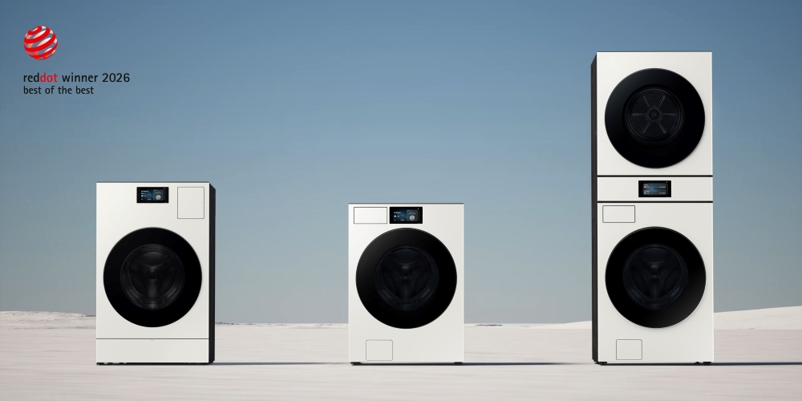
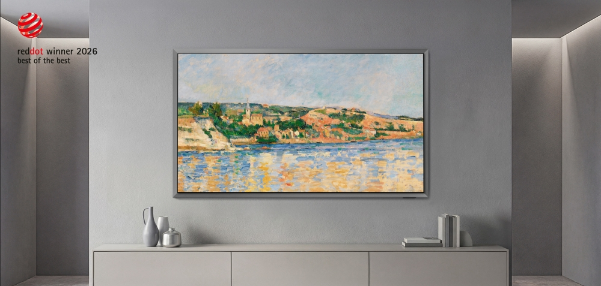

2026-04-28

# 三星包揽16项红点大奖，100%命中率，红点奖真的只看品牌名气吗？

**——深度拆解三星2026红点设计奖全胜之谜，16件获奖作品完整清单及盲评机制真相**

4月28日，三星电子宣布了一个令设计界瞠目的消息：在2026年红点设计奖（Red Dot Design Award）中，公司提交的16件产品设计作品**全部获奖**，其中包括两项最高荣誉"最佳中的最佳"（Best of the Best)。

消息一出，设计圈炸开了锅。

有人感慨"三星设计确实强"，也有人冷笑："大厂参赛，评委哪敢不给奖？"更有参赛者直言："我们小团队交钱陪跑，红点就是看品牌说话。"

真相到底是什么？

在讨论"品牌是否能让评委偏心"之前，我们必须先搞清楚一个更关键的问题：**红点奖的评审机制本身，允许评委看见品牌吗？**

---

## 01 红点奖是"盲评"的吗？

**答案是：至少在规则层面，红点奖采用了严格的"匿名盲审"制度。**

据红点奖官方规定，参赛作品在递交评审时均需匿名，不得含有设计师照片或公司Logo。作品仅以编号呈现，评委无法获知参赛者身份，从机制上杜绝利益输送。

但这套"盲评"远不止匿名这么简单。红点奖建立了一整套评审隔离防线：

**第一，评委独立性。** 2025年红点产品设计奖评审团由来自21个国家的43位专家组成，涵盖设计、科学、媒体等多个领域。红点创始人彼得·扎克教授明确：评委必须是独立的——只有学术界或独立设计师才能担任；受雇于业界公司者，失去评委资格。

**第二，利益冲突。** 每位评委必须遵守《诚信守则》，不得参与当年的比赛，也不能是制造企业雇员。曾有评委因无法回避自己指导学生的作品而退出评审。此外，评委必须在"做红点评委"与"得红点奖"之间二选一，不可兼得。

**第三，动态轮换。** 每年红点更换约20%的评委，余者任期3-5年，不断注入新视角，避免审美固化。

**第四，实物检验。** 这是红点区别于iF等赛事的关键。评委看到的是**实物**，会亲手使用产品，基于真实体验而非照片或渲染图做判断。任何精致渲染或品牌包装，都无法替代产品本身的品质检验。

**——那么问题来了：既然盲评，评委怎么还能认出三星？**

关键在于：**盲评不等于"品牌彻底隐身"。**

当评委接触实物产品时，"品牌"其实无法彻底隐藏。以三星为例，哪怕在送审样品上抹掉Logo，其高度统一的工业设计语言——标志性的悬浮感美学、极简曲线、独特形态——评委看一眼就能认出出自谁手。这就是"设计识别度"带来的"隐形品牌曝光"。

此外，评审包含现场讨论环节。一件作品以编号进入时是匿名的，但讨论中被热烈推荐时，评委席中有人可能认出"这是某某品牌"，这种信息传递无法完全杜绝。

**所以公允的判断是：评审起点是盲评，但终点不是。**

在匿名提交规则层面，红点采取了严格的遮挡措施；但在评委的专业识别力层面，顶尖品牌的"隐形身份"始终存在。三星100%命中率反映的，不一定是"评委偏爱大厂"，而是其多年打造的"高识别度设计体系"本身，已具备让评委仅凭样品质感、形态和功能逻辑就能识别出"这是三星"的硬实力。

从这个角度再去看"大满贯"，也许有更立体的理解。下面，我们逐一拆解这16件获奖作品，看看它们究竟凭何征服评委。

## 02 "最佳中的最佳"：两件桂冠背后的设计密码

本届红点产品设计类别的最高荣誉——Best of the Best——由三星的**OLED电视S95H**和**Bespoke AI洗衣系列**摘得。

### 1. S95H OLED TV："悬浮美学"重新定义电视

**获奖理由**：S95H正面采用金属材质银色边框，营造出超薄OLED屏幕仿佛悬浮于主机之上的视觉效果。银色边框与墙壁自然融合，宛如一件精致壁挂艺术品，极大增强了视觉沉浸感。

三星将这套设计语言命名为 **"FloatLayer Design"** ——一种将超薄OLED显示屏与金属背板结合的新型分层概念。它彻底改变了电视作为"黑色矩形盒子"的传统形象，将其升华为与环境相融的"物件型电视"。

### 2. Bespoke AI洗衣系列：统一中求变的"家族化设计"

**获奖理由**：该系列将统一设计语言贯穿于洗衣机、烘干机、一体机等多种产品，同时保留每款的个性。配备7英寸大尺寸触摸屏，用户可直观控制SmartThings和AI功能。

这种 **"统一中求变"** 体现了三星"Expressive Design"——以人为中心，反映用户身份认同、情感和多样性的设计方法论。

## 03 14件Winner：三星的"设计军团"完整清单

除两件Best of the Best外，以下14件产品均获得2026红点产品设计奖"Winner"殊荣。

| 序号 | 产品名称 | 类别 | 链接 |
| :--: | :--------------------------------------------------------- | :-------------------------- | :----------------------------------------------------------- |
|  3   | **Music Studio 5**                                         | Wi-Fi音箱                   | [新闻稿](https://news.samsung.com/kr/삼성전자-2026년형-뮤직-스튜디오-공개) |
|  4   | **The Moving Style**                                       | 便携式触控显示屏            | [新闻稿](https://news.samsung.com/sg/samsung-launches-the-movingstyle-portable-touchscreen-display-in-singapore) |
|  5   | **Bespoke AI Family Hub Refrigerator**                     | Bespoke AI冰箱              | 三星官网Bespoke系列 |
|  6   | **Bespoke AI AirDresser**                                  | Bespoke AI衣物护理机        | 三星官网Bespoke系列 |
|  7   | **Bespoke AI Water Purifier & Ice Water Purifier**         | Bespoke AI净水器/冰水净水器 | 三星官网Bespoke系列 |
|  8   | **AI Wind-Free Combo Pro Wall-Mounted AC**                 | 壁挂式空调                  | 三星官网空调产品页 |
|  9   | **Bespoke AI Wind-Free Combo Gallery Pro (Stand-type AC)** | 立式空调                    | 三星官网空调产品页 |
|  10  | **Bespoke AI Steam Ultra & Plus Robot Vacuum**             | 机器人吸尘器                | 三星官网吸尘器产品页 |
|  11  | **Jet Fit (Cordless Stick Vacuum Cleaner)**                | 无线杆式吸尘器              | 三星官网吸尘器产品页 |
|  12  | **Galaxy Z Fold 7**                                        | 折叠屏手机                  | [Galaxy Z Fold 7页面](https://www.samsung.com/us/smartphones/galaxy-z-fold7/) |
|  13  | **Galaxy XR**                                              | 扩展现实头显                | [Galaxy XR支持页面](https://www.samsung.com/us/support/owners/product/galaxy-xr-headset) |
|  14  | **5G Street Radio Solution**                               | 5G街边广播解决方案          | 三星网络解决方案官网 |
|  15  | **Spatial Signage (Glasses-free 3D Display)**              | 裸眼3D空间显示屏            | 三星商用显示官网 |
|  16  | **Portable SSD T7 Resurrected**                            | 便携式SSD T7复活版          | 三星存储官网 |

## 04 100%获奖率给参赛者的5条实战启示

三星的"大满贯"不是靠品牌名气躺赢。以下5点，是每一个准备参赛的设计师可以真正带走的方法论。

**启示一：构建统一且有辨识度的家族化设计语言**

Bespoke AI系列从洗衣到冰箱到空调，视觉识别系统彼此关联又自成一格。"协同作战"大幅提升了整体成功率。参赛时，如果你提交的是一个系列产品，务必在材料中突出其语言一致性。

**启示二：让产品与环境"共生"，而非"占据"**

S95H获奖的关键在于它不再是客厅里的黑色矩形，而是一件与环境融为一体的"物件"。参赛时，要清晰地告诉评委：你的设计如何与用户的空间、生活发生对话。

**启示三：AI不是口号，是可感知的用户价值**

三星几乎所有嵌入了AI的产品，在参赛叙事中强调的不是AI多么"前沿"，而是"触摸屏多大、操作多简单、能为用户节约多少时间"。**把技术翻译成评委能感知的日常价值。**

**启示四：用设计回应时代情绪**

S95H回应的是"电视不再占据视觉中心"；Bespoke洗衣系列回应的是"家电要好看、要智能、要融入家居风格"。参赛时，你的设计在回应什么时代命题？请写在第一屏。

**启示五：建立系统级设计能力**

16件产品横跨电视、白电、移动设备、商用显示，全部获奖，背后是高度成熟的设计体系支撑。对个人或小团队而言，虽然无法复制三星的规模，但可以学习其**设计语言的一致性与系统性**——这是国际评审极为看重的素养。

## 写在最后

回到开头的疑问：红点奖真的只看品牌名气吗？

盲评机制从规则上杜绝了"看logo给奖"；实物评审更是让产品本质暴露无遗。三星的16项大奖，与其说是"品牌特权"，不如说是一次**设计体系、工程能力和用户洞察的系统性胜利**。

对于正在准备参赛的你，与其纠结"评委是否偏袒大厂"，不如静下心来研究：三星的设计语言为何一眼可辨？它的每件产品如何回应人的真实需求？你的作品，能否在匿名送审时，仅凭形态、质感和功能逻辑就让评委眼前一亮？

**设计不问出身，但问实力。** 这或许才是红点奖——也是所有国际大奖——最公平的地方。

---

*本文基于2026年4月28日三星电子官方公布的红点奖获奖信息及公开报道撰写，案例解读为原创分析。*
